# Forma UX Mobile Prompt - Complete Flow Diagram

## MERMAID FLOWCHART (Copy into Mermaid Live Editor: https://mermaid.live)

```mermaid
graph TD
    Start["🚀 START: Forma UX Mobile Prompt"] --> 00["STEP 0.0<br/>Language Selection<br/>English or Italian?"]
    
    00 --> Checkpoint0["✓ CHECKPOINT<br/>Confirm language"]
    Checkpoint0 --> 05["STEP 0.5<br/>Component Test Mode?<br/>YES or NO?"]
    
    05 --> CheckpointYES{"YES?"}
    05 --> CheckpointNO{"NO?"}
    
    CheckpointYES -->|YES| 051["FAST TRACK<br/>Screen Type + Description<br/>+ Custom Components"]
    CheckpointNO -->|NO| 100["STEP 1.0<br/>Strategic Brief<br/>Full Workflow"]
    
    051 --> 50Fast["STEP 5.0<br/>Pre-Generation Validation<br/>FAST TRACK"]
    50Fast --> 60Fast["STEP 6.0<br/>Generate Mobile Mockup<br/>HTML Artifact"]
    60Fast --> 70Loop["STEP 7.0<br/>Iteration & Refinement"]
    
    100 --> Checkpoint10["✓ CHECKPOINT<br/>Proceed to 1.1?"]
    Checkpoint10 --> 11["STEP 1.1<br/>Screen Purpose<br/>The WHAT"]
    
    11 --> 12["STEP 1.2<br/>User Actions<br/>The HOW"]
    12 --> 13["STEP 1.3<br/>Context<br/>The WHERE"]
    13 --> 14["STEP 1.4<br/>Primary User<br/>The WHO (Optional)"]
    14 --> 15["STEP 1.5<br/>Success Metric<br/>The WHY (Optional)"]
    
    15 --> Checkpoint16["✓ CHECKPOINT<br/>Proceed to 1.6?"]
    Checkpoint16 --> 16["STEP 1.6<br/>UX Strategy Checkpoint<br/>Choose Mobile Framework"]
    
    16 --> FrameworkChoice["Choose Mobile UX Framework:<br/>1. Tab Navigation<br/>2. Drawer Navigation<br/>3. Stacked Navigation<br/>4. Flat Navigation"]
    
    FrameworkChoice --> Checkpoint20["✓ CHECKPOINT<br/>Proceed to 2.0?"]
    Checkpoint20 --> 20["STEP 2.0<br/>Mobile Layout Pattern<br/>Selection"]
    
    20 --> DecisionPath{"Standard Pattern<br/>fits Framework?"}
    
    DecisionPath -->|YES - Path A| PathA["PATH A: Standard-Informed<br/>Choose from 7 Mobile Patterns"]
    DecisionPath -->|NO - Path B| PathB["PATH B: Creative-Custom<br/>Mobile Design Workshop"]
    
    PathA --> PatternChoice["Choose Mobile Pattern:<br/>1. Bottom Tab Nav<br/>2. Drawer + Content<br/>3. Stacked Nav<br/>4. Single-Screen Focus<br/>5. Tab + Drawer Hybrid<br/>6. Hero + Scroll<br/>7. Modal/BottomSheet"]
    
    PathB --> 23["STEP 2.3<br/>Custom Mobile Design<br/>Workshop"]
    PatternChoice --> 24["STEP 2.4<br/>UX Interaction Model<br/>Touch-Optimized"]
    23 --> 24
    
    24 --> 25["STEP 2.5<br/>🔒 CONSTRAINTS LOCKED<br/>Header, Nav, Content, FAB<br/>Viewport, Safe Area<br/>MANDATORY CHECKPOINT"]
    
    25 --> Checkpoint26["✓ CHECKPOINT<br/>Confirm Constraints?"]
    Checkpoint26 --> 26["STEP 2.6<br/>🔒 CONSTRAINTS CONFIRMATION<br/>MANDATORY CHECKPOINT"]
    
    26 --> 30["STEP 3.0<br/>Detailed Requirements<br/>3.1-3.6 Questions"]
    
    30 --> 31["3.1 Header/Status Bar"]
    31 --> 32["3.2 Primary Title"]
    32 --> 33["3.3 Screen Description"]
    33 --> 34["3.4 Content Layout"]
    34 --> 35["3.5 User Gestures"]
    35 --> 36["3.6 Mobile Components"]
    
    36 --> Checkpoint40["✓ CHECKPOINT<br/>Proceed to 4.0?"]
    Checkpoint40 --> 40["STEP 4.0<br/>Mobile Component Selection<br/>BottomTabBar, FAB, Drawer, etc."]
    
    40 --> 41["STEP 4.1-4.3<br/>Component List<br/>Compilation & Checklist"]
    
    41 --> 44["STEP 4.4<br/>🔒 Final Confirmation<br/>MANDATORY CHECKPOINT"]
    
    44 --> Checkpoint51["✓ CHECKPOINT<br/>Proceed to 5.0?"]
    Checkpoint51 --> 51["STEP 5.0<br/>Pre-Generation Validation<br/>48px touch targets<br/>375px viewport<br/>MANDATORY CHECKPOINT"]
    
    51 --> Checkpoint60["✓ CHECKPOINT<br/>Ready to Generate?"]
    Checkpoint60 --> 60["STEP 6.0<br/>Generate Mobile Mockup<br/>HTML Artifact<br/>MANDATORY CHECKPOINT"]
    
    60 --> Monitor["Resource Monitoring<br/>Token Usage Check"]
    Monitor --> 70["STEP 7.0<br/>Iteration & Refinement"]
    
    70 --> 71["STEP 7.1<br/>User Feedback<br/>Request Changes"]
    71 --> 72["STEP 7.2<br/>Designer Updates Artifact<br/>/UPDATE or /REWRITE"]
    72 --> 73["STEP 7.3<br/>Iteration Loop<br/>Repeat 7.1-7.2"]
    
    73 --> LoopDecision{"More Changes?"}
    LoopDecision -->|YES| 71
    LoopDecision -->|NO| End["✅ COMPLETE<br/>Generate Continuation Kit<br/>Save & Export"]
    
    70Loop --> 71L["User Feedback"]
    71L --> 72L["Update Artifact"]
    72L --> 73L["Continue Iteration"]
    73L --> LoopDecision2{"More Changes?"}
    LoopDecision2 -->|YES| 71L
    LoopDecision2 -->|NO| End
    
    style Start fill:#4F46E5,color:#fff
    style End fill:#22C55E,color:#fff
    style 25 fill:#DC2626,color:#fff
    style 26 fill:#DC2626,color:#fff
    style 44 fill:#DC2626,color:#fff
    style 51 fill:#DC2626,color:#fff
    style 60 fill:#DC2626,color:#fff
    style Checkpoint0 fill:#F59E0B,color:#000
    style Checkpoint10 fill:#F59E0B,color:#000
    style Checkpoint16 fill:#F59E0B,color:#000
    style Checkpoint20 fill:#F59E0B,color:#000
    style Checkpoint26 fill:#F59E0B,color:#000
    style Checkpoint40 fill:#F59E0B,color:#000
    style Checkpoint51 fill:#F59E0B,color:#000
    style Checkpoint60 fill:#F59E0B,color:#000
```



---

## ASCII DIAGRAM (Quick Visual Reference)

```
╔════════════════════════════════════════════════════════════════════════════════╗
║               FORMA UX MOBILE PROMPT - COMPLETE FLOW (Simplified)              ║
╚════════════════════════════════════════════════════════════════════════════════╝

                                START (Step 0.0)
                                      ↓
                          Language Selection (EN/IT)
                                      ↓
                          CHECKPOINT: Confirm ✓
                                      ↓
                        ┌─────────────────────────┐
                        │  STEP 0.5              │
                        │  Component Test Mode?  │
                        │  YES or NO?            │
                        └─────────────────────────┘
                                  ↙        ↖
                            YES /            \ NO
                          /                    \
        ┌──────────────────────────┐   ┌────────────────────────────┐
        │  FAST TRACK              │   │  FULL WORKFLOW             │
        │  (Component Test Mode)   │   │  (Steps 1.0 - 7.0)        │
        └──────────────────────────┘   └────────────────────────────┘
                    ↓                               ↓
        ┌──────────────────────────┐   ┌────────────────────────────┐
        │ 0.5: Screen Type         │   │ 1.0: Strategic Brief      │
        │      + Description       │   │ 1.1: Purpose (WHAT)       │
        │      + Custom Comp       │   │ 1.2: Actions (HOW)        │
        └──────────────────────────┘   │ 1.3: Context (WHERE)      │
                    ↓                   │ 1.4: User (WHO)           │
        ┌──────────────────────────┐   │ 1.5: Success (WHY)        │
        │ PROCEED TO 5.0           │   └────────────────────────────┘
        │ (Skip 1.0-4.0)           │               ↓
        └──────────────────────────┘   ┌────────────────────────────┐
                    ↓                   │ CHECKPOINT: Proceed to 1.6?│
                    │                   │ ✓ YES/NO                   │
                    │                   └────────────────────────────┘
                    │                               ↓
                    │                   ┌────────────────────────────┐
                    │                   │ 1.6: Mobile UX Strategy    │
                    │                   │ Choose Framework:          │
                    │                   │ 1. Tab Navigation          │
                    │                   │ 2. Drawer Navigation       │
                    │                   │ 3. Stacked Navigation      │
                    │                   │ 4. Flat Navigation         │
                    │                   └────────────────────────────┘
                    │                               ↓
                    │                   ┌────────────────────────────┐
                    │                   │ CHECKPOINT: Proceed to 2.0?│
                    │                   │ ✓ YES/NO                   │
                    │                   └────────────────────────────┘
                    │                               ↓
                    │                   ┌────────────────────────────┐
                    │                   │ 2.0: Mobile Layout Pattern │
                    │                   │ Choose from 7 Patterns:    │
                    │                   │ 1. Bottom Tab Nav          │
                    │                   │ 2. Drawer + Content        │
                    │                   │ 3. Stacked Nav             │
                    │                   │ 4. Single-Screen Focus     │
                    │                   │ 5. Tab + Drawer Hybrid     │
                    │                   │ 6. Hero + Scroll           │
                    │                   │ 7. Modal/BottomSheet       │
                    │                   └────────────────────────────┘
                    │                               ↓
                    │                   ┌────────────────────────────┐
                    │                   │ 2.4: UX Interaction Model  │
                    │                   │ Touch-Optimized            │
                    │                   └────────────────────────────┘
                    │                               ↓
                    │                   ┌────────────────────────────┐
                    │                   │ 2.5: 🔒 CONSTRAINTS LOCKED │
                    │                   │ Header, Nav, Content, FAB  │
                    │                   │ Viewport 375px             │
                    │                   │ Safe Area                  │
                    │                   │ MANDATORY ⚠️               │
                    │                   └────────────────────────────┘
                    │                               ↓
                    │                   ┌────────────────────────────┐
                    │                   │ CHECKPOINT:                │
                    │                   │ Confirm Constraints?       │
                    │                   │ ✓ YES/NO                   │
                    │                   └────────────────────────────┘
                    │                               ↓
                    │                   ┌────────────────────────────┐
                    │                   │ 2.6: 🔒 CONFIRMATION       │
                    │                   │ MANDATORY ⚠️               │
                    │                   └────────────────────────────┘
                    │                               ↓
                    │                   ┌────────────────────────────┐
                    │                   │ 3.0: Detailed Requirements │
                    │                   │ 3.1-3.6 Mobile-Specific    │
                    │                   └────────────────────────────┘
                    │                               ↓
                    │                   ┌────────────────────────────┐
                    │                   │ 4.0: Mobile Components     │
                    │                   │ BottomTabBar, FAB, Drawer  │
                    │                   │ SegmentControl, ActionSheet │
                    │                   └────────────────────────────┘
                    │                               ↓
                    │                   ┌────────────────────────────┐
                    │                   │ 4.4: 🔒 CONFIRMATION       │
                    │                   │ MANDATORY ⚠️               │
                    │                   └────────────────────────────┘
                    │                               ↓
                    └───────────────→  ┌────────────────────────────┐
                                       │ 5.0: Pre-Generation Valid  │
                                       │ 48px touch targets         │
                                       │ 375px viewport check       │
                                       │ No hover states            │
                                       │ MANDATORY ⚠️               │
                                       └────────────────────────────┘
                                                   ↓
                                       ┌────────────────────────────┐
                                       │ CHECKPOINT:                │
                                       │ Ready to Generate?         │
                                       │ ✓ YES/NO                   │
                                       └────────────────────────────┘
                                                   ↓
                                       ┌────────────────────────────┐
                                       │ 6.0: Generate Mobile Mockup│
                                       │      HTML Artifact         │
                                       │ MANDATORY ⚠️               │
                                       └────────────────────────────┘
                                                   ↓
                                       ┌────────────────────────────┐
                                       │ Resource Monitoring        │
                                       │ Token Usage Check          │
                                       └────────────────────────────┘
                                                   ↓
                        ┌───────────────────────────────────┐
                        │ 7.0: Iteration & Refinement       │
                        │ 7.1: User Feedback                │
                        │ 7.2: Update Artifact              │
                        │ 7.3: Loop (Repeat 7.1-7.2)        │
                        └───────────────────────────────────┘
                                    ↙        ↖
                            More changes?  No more changes
                                    ↙            ↖
                                    │             │
                        ────────────┘             │
                        (repeat 7.1-7.2)          ↓
                                            ┌──────────────┐
                                            │ ✅ COMPLETE  │
                                            │ Continuation │
                                            │ Kit          │
                                            └──────────────┘

═══════════════════════════════════════════════════════════════════════════════

KEY SYMBOLS:
━━━━━━━━━━━━━
✓  = CHECKPOINT (Explicit confirmation required)
🔒 = MANDATORY CHECKPOINT (Cannot be skipped)
⚠️  = CRITICAL STEP (Must follow constraints)
→  = Flow direction

COLOR CODING (Mermaid):
━━━━━━━━━━━━━━━━━━━━
🔵 Blue = Start/Major transitions
🟢 Green = End/Completion
🔴 Red = Mandatory checkpoints
🟠 Orange = Explicit confirmations
```

---

## 📊 MOBILE FLOW STATISTICS

| Aspect | Count | Details |
|--------|-------|---------|
| **Total Steps** | 9 main | 0.0, 0.5, 1.0, 2.0, 3.0, 4.0, 5.0, 6.0, 7.0 |
| **Sub-steps** | 15+ | 1.1-1.5, 2.1-2.6, 3.1-3.6, 4.1-4.4, 7.1-7.2 |
| **Explicit Checkpoints** | 12+ | YES/NO confirmations at each step |
| **Mandatory Checkpoints** | 5 | 🔒 Steps 2.5, 2.6, 4.4, 5.1, 6.0 |
| **Mobile UX Frameworks** | 4 | Tab Nav, Drawer Nav, Stacked Nav, Flat Nav |
| **Mobile Layout Patterns** | 7 | Bottom Tab, Drawer+Content, Stacked, Single-Screen, Hybrid, Hero+Scroll, Modal |
| **Decision Points** | 2 | Component Test Mode (YES/NO), Layout Path (A/B) |
| **Fast Track Path** | 3-4 steps | 0.0→0.5→Fast Track→5.0→6.0 (≈2-3 min) |
| **Full Workflow Path** | 20+ steps | 0.0→0.5→1.0-7.0 (≈25+ min) |
| **Iteration Loop** | ∞ | 7.1-7.2 (repeat until satisfied) |

---

## 🎯 DECISION TREE POINTS

### Decision 1: Component Test Mode (Step 0.5)
```
YES → Fast Track (Skip 1.0-4.0) → Direct to 5.0 (≈2-3 min)
NO  → Full Workflow (1.0-7.0) → Complete strategic process (≈25+ min)
```

### Decision 2: UX Framework (Step 1.6)
```
Choose from 4 Mobile UX Frameworks:
1. Tab Navigation       → Bottom tabs for frequent tasks
2. Drawer Navigation   → Slide-out drawer for nav
3. Stacked Navigation  → Linear workflow with back button
4. Flat Navigation     → All content from home screen
```

### Decision 3: Layout Pattern (Step 2.0)
```
PATH A: Standard Pattern → Use one of 7 mobile patterns
PATH B: Custom Layout    → Design workshop collaboration
```

### Decision 4: Iteration (Step 7.3)
```
More Changes? → YES → Repeat 7.1-7.2
             → NO  → Complete & Export
```

---

## ⏱️ TIME ESTIMATES (Mobile)

| Path | Time | Steps |
|------|------|-------|
| **Fast Track** (Component Test Mode) | ~2-3 min | 0.0 → 0.5 → Fast → 5.0-6.0 |
| **Standard Workflow** (No Custom) | ~20-25 min | All steps, Path A (2.0) |
| **Custom Workflow** (With Custom Layout) | ~25-35 min | All steps, Path B (2.3) |
| **With Iterations** (Multiple mockups) | +8-12 min/iteration | Add Step 7.0 loop |

---

## 📋 MOBILE-SPECIFIC FEATURES

```
FAST TRACK ONLY SKIPS:
✗ Step 1.0 - Strategic Brief
✗ Step 1.6 - UX Strategy (uses defaults)
✗ Step 2.0 - Layout Pattern (uses defaults)
✗ Step 3.0 - Detailed Requirements (uses generic content)
✗ Step 4.0 - Component Selection (uses matrix)

KEEPS:
✓ Step 5.0 - Validation (48px touch targets, 375px viewport)
✓ Step 6.0 - Generation
✓ Step 7.0 - Iteration
```

---

## 🏗️ MOBILE LAYOUT PATTERNS AT A GLANCE

```
┌─────────────────────────────────────────────────────┐
│ Pattern 1: Bottom Tab Navigation                    │
├─────────────────────────────────────────────────────┤
│ ┌─────────────────────────────────┐                │
│ │  Header                         │                │
│ ├─────────────────────────────────┤                │
│ │                                 │                │
│ │  Main Content (Scrollable)      │                │
│ │                                 │                │
│ ├─────────────────────────────────┤                │
│ │ [Tab1] [Tab2] [Tab3] [Tab4]    │  ← Fixed       │
│ └─────────────────────────────────┘                │
└─────────────────────────────────────────────────────┘

┌─────────────────────────────────────────────────────┐
│ Pattern 2: Drawer + Main Content                    │
├─────────────────────────────────────────────────────┤
│ ┌──────┬──────────────────────────┐                │
│ │ Menu │ Header                   │                │
│ │ Item │ ├──────────────────────┤ │                │
│ │ Item │ │                      │ │                │
│ │ Item │ │  Main Content        │ │                │
│ │ Item │ │  (Scrollable)        │ │                │
│ │      │ │                      │ │                │
│ └──────┴──────────────────────────┘                │
└─────────────────────────────────────────────────────┘

┌─────────────────────────────────────────────────────┐
│ Pattern 3: Stacked Navigation                       │
├─────────────────────────────────────────────────────┤
│ Home ← List ← Detail ← Form                         │
│  │      │      │       │                            │
│  └─────→└─────→└──────→└─ Back Button               │
│                                                      │
│ Linear workflow with back navigation                │
└─────────────────────────────────────────────────────┘

┌─────────────────────────────────────────────────────┐
│ Pattern 4: Single-Screen Focus                      │
├─────────────────────────────────────────────────────┤
│ ┌─────────────────────────────────┐                │
│ │ Header + One Primary Action     │                │
│ ├─────────────────────────────────┤                │
│ │                                 │                │
│ │  Single Task/Content            │                │
│ │  (Scrollable if needed)         │                │
│ │                                 │                │
│ │  ┌───────────────────────────┐  │                │
│ │  │  [Primary Action Button]  │  │                │
│ │  └───────────────────────────┘  │                │
│ └─────────────────────────────────┘                │
└─────────────────────────────────────────────────────┘
```

---

## 🔄 WEB vs MOBILE WORKFLOW COMPARISON

| Feature | Web | Mobile | Difference |
|---------|-----|--------|-----------|
| Fast Track Available | ✅ YES (0.5.1-0.5.6) | ✅ YES (but simplified) | Mobile has fewer steps |
| Layout Patterns | 7 patterns | 7 mobile patterns | Mobile-optimized (tabs, FAB, drawer) |
| Mandatory Checkpoints | 5 | 5 | Same count |
| Total Steps | 9 | 9 | Same structure |
| Component-Specific | Web components | Mobile components | Different catalogues |
| Viewport | Responsive (1025px+) | Fixed (375px) | Mobile: specific width |
| Touch Targets | Not applicable | 48px minimum | Mobile requirement |
| Navigation | Fixed header + sidebar | Bottom tabs or drawer | Mobile paradigm |
| Est. Time (Full) | 30-45 min | 25-35 min | Mobile slightly faster |
| Est. Time (Fast) | 3-5 min | 2-3 min | Mobile faster |

---

## 💡 MOBILE-SPECIFIC TIPS

1. **For Quick Mobile Mockup:** Choose YES at Step 0.5 → ~2-3 minutes
2. **For Strategic Design:** Choose NO at Step 0.5 → ~25-35 minutes
3. **Watch touch targets:** Always validate 48px minimum in Step 5.0
4. **Test viewport:** Always check 375px width constraint
5. **No hover states:** Use active/pressed/ripple effects instead
6. **Bottom navigation:** Thumb zone is critical for mobile UX
7. **Safe areas:** Always respect notches and home indicators

---

**Last Updated:** October 27, 2025

**Diagram Created:** Forma UX System v1
